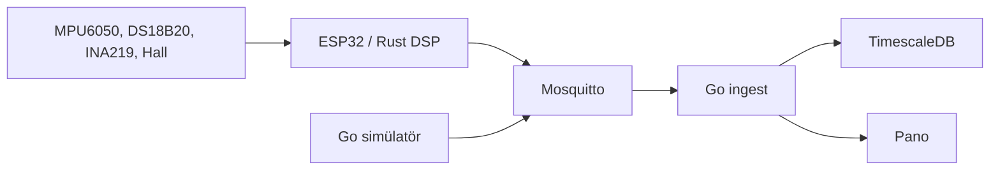

# SENTRA

12 V'luk bir DC motorun titreşimini, sıcaklığını, akımını, gerilimini ve devrini kenarda özetleyip tek bir telemetri çerçevesi olarak izleyen öngörücü bakım sistemi.

Cihaz her pencerede ham ivme örneklerini tutar ve yalnızca RMS, tepe, crest factor, kurtosis ve baskın frekansı yayınlar. Böylece 1 kHz'lik bir pencere, saniyede bir küçük JSON olur. Anomali modeli sonraki aşamadadır; V1'in işi bu çerçevenin doğru, test edilmiş ve donanımsız da çalışır olmasıdır.



## Neden bu diller

| Katman | Dil | Gerekçe |
| --- | --- | --- |
| Kenar ve DSP | Rust | Çöp toplayıcı yok, aynı kod dizüstü bilgisayarda test edilip ESP32'ye taşınır |
| Toplama, API, pano | Go | MQTT tüketicisi, HTTP ve veritabanı yazması tek süreçte sade durur |
| Öğrenme (V2+) | Python | xgboost ve SHAP burada olgun |

Kararların uzun hali `docs/decisions/` altındadır. İlk prompt `docs/original-prompt.md` dosyasında saklanır.

## Durum

V1 veri toplama tamam. V2 özellik modülü kullanıcı onayı bekler. Sağlık skoru bu panoda bilinçli olarak yoktur.

## Çalıştırma

Araçlar: Rust 1.83+, Go 1.22+, Docker Compose yalnızca tam yığın için.

```bash
cd sentra
make test
```

Donanımsız pano, bellek içi depo ile:

```bash
cd sentra/pipeline
SENTRA_STORE=memory SENTRA_HTTP_ADDR=127.0.0.1:8088 go run ./cmd/ingest
```

İkinci uçta simülatör dört rejimi sırayla basar:

```bash
cd sentra/pipeline
SENTRA_TRANSPORT=http SENTRA_INGEST_URL=http://127.0.0.1:8088 \
  SENTRA_REGIME=cycle SENTRA_REGIME_PERIOD=1 SENTRA_INTERVAL_MS=1000 \
  go run ./cmd/simulator
```

Pano: [http://127.0.0.1:8088](http://127.0.0.1:8088)

Kenar düğümünün dizüstü karşılığı seri porta JSON basar. `SENTRA_MQTT_BROKER=mqtt://127.0.0.1:1883` verilirse aynı çerçeveyi QoS 1 ile yayınlar.

```bash
cd sentra/firmware
SENTRA_MAX_FRAMES=3 cargo run -p sentra-edge
```

Tam yığın, Insucom sitesinin 5432 portuna çarpmamak için Postgres'i 5433'te, API'yi 8088'de açar:

```bash
cd sentra
docker compose up --build
```

Ortam değişkenlerinin listesi `.env.example` dosyasındadır. Compose içindeki `sentra/sentra` parolası yalnızca yerel laboratuvardır.

## Düzen

```text
firmware/sentra-core   DSP, sensör kod çözücüleri, çerçeve doğrulama
firmware/sentra-edge   host düğüm ve küçük MQTT 3.1.1 istemcisi
firmware/esp32         kart pinleri ve taşıma notu
pipeline/cmd/ingest    MQTT + HTTP + pano
pipeline/cmd/simulator NORMAL, OVERLOAD, UNBALANCED, HIGH_VIBRATION
testdata/              iki dilin paylaştığı sayısal oracle
```

ESP32 aygıt yazılımı aynı `sentra-core` fonksiyonlarını çağıracak. Register dönüşümleri kart olmadan test edilir. Flash adımları `firmware/esp32/README.md` içindedir. Kart yokken çalışan yol host düğümüdür; sahte bir derleme hedefi eklenmedi.

## Sözleşme

`schema/telemetry.md` alanları, birimleri ve reddedilen aralıkları yazar. Örnek çerçeve `testdata/frame_normal.json`.

Konular:

- `sentra/v1/{device_id}/telemetry`
- `sentra/v1/{device_id}/label`
- `sentra/v1/{device_id}/status`

`label` bir model çıktısı değildir. Simülatörün veya teknisyenin yazdığı zemindir. V4 bu etiketi eğitimde kullanır.

## Test

`make test` Rust ve Go sınamalarını çalıştırır. Kapsananlar: DSP oracle'ı, INA219 kalibrasyonu, Hall RPM, DS18B20, çerçeve doğrulama, MQTT paket kodlama, konu ayrıştırma, bellek deposu, HTTP ingest ve rejim ayrımı.

Postgres turu `SENTRA_TEST_DATABASE_URL` ile açılır; değişken yokken sınama atlanır, bellek deposu API'yi ayakta tutar.

## Sonraki aşama

V2, `docs/dsp.md` formüllerinin Python karşılığı ve kayıtlı özellik tablosu olacak. Onay olmadan başlanmaz.
