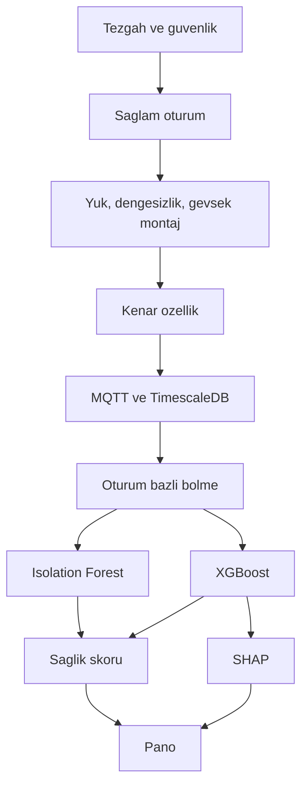
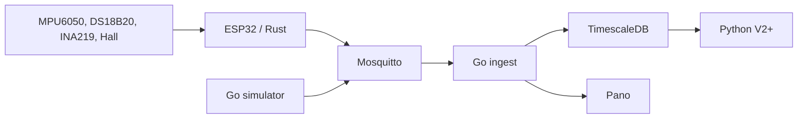

# SENTRA

12 V doğru akım motorunun gövde titreşimini, sıcaklığını, akımını, gerilimini ve devrini izleyen öngörücü bakım tezgahı. Amaç, motor bozulduktan sonra müdahale etmek değil; aynı motorun kendi sağlam kaydından sapmayı erken görmek.

Her saniye cihaz bir titreşim penceresi toplar, ortalamayı (yerçekimi ofsetini) çıkarır ve yalnızca özeti yayınlar: RMS, tepe, crest factor, kurtosis, baskın frekans, artı yavaş kanallar (devir, akım, gerilim, sıcaklık). Ham örnek hatta kalmaz. Pano bu çerçeveyi canlı gösterir. Model katmanı sonraki sürümlerdedir; aşağıdaki metodoloji o katmanın hangi yayına dayandığını ve hangi veriyle eğitileceğini kilitler.

Kod `sentra/` altındadır. Bu deponun `backend/` ve `frontend/` ağacı ayrı bir sigorta sitesidir. SENTRA onu değiştirmez.

## Literatürden ne çıktı

Taranan işler iki aileye ayrılıyor. Birinci aile, kontrollü tezgâhta titreşim toplayıp sınıflandırıcı kıyaslıyor. İkinci aile, ESP32 ve birkaç sensörle MQTT’ye veri basan öğrenci uygulaması. Birinci ailenin ölçüm dili bu projeye girer. İkinci ailenin doğruluk cümleleri, oturum sızıntısı ve endüstriyel ivmeölçer olmadığı için rakam olarak devralınmaz.

| Kaynak | Düzen | Ne işe yaradı | SENTRA’ya etkisi |
| --- | --- | --- | --- |
| Kim, Lee, Wang, Lee. *Sensors* 2023, 23(5), 2585. [10.3390/s23052585](https://doi.org/10.3390/s23052585) | Asenkron motor, endüstriyel ivmeölçer, 1240 pencere × 1024 örnek, normal / rotor / rulman. SVM, çok katmanlı ağ, CNN, GBM, XGBoost. Katmanlı K-kat. | XGBoost (700 ağaç): normal %99,11, rotor %99,76, rulman %100. Test süresi ortalama 0,050 s. SVM 1,65 s. Yazarlar en yüksek doğruluğu SVM ve CNN’de, en yüksek hızı XGBoost’ta bulmuş. | Ham dalga üzerinde CNN bu tezgâhta kazanabiliyor. Biz ham dalgayı sürekli taşımıyoruz. Özellik tablosunda XGBoost hem hızlı hem SHAP ile açıklanabilir. CNN, ancak özellik modeli yetersiz kalırsa ve şüpheli pencerenin ham hali ayrıca kaydedilirse ikinci deney olur. |
| Ali ve diğerleri, *IEEE Trans. Energy Conversion*, 2024. [10.1109/TEC.2024.3405897](https://doi.org/10.1109/TEC.2024.3405897) | Asenkron motor, stator elektrik ölçümü + titreşim, altı durum (sağlam, kırık rotor çubuğu, dengesizlik ve sargı kısa devresi bileşimleri). | Ayarlanmış XGBoost için bildirilen doğruluk %96,06. Ayarsız modele göre yaklaşık %15 iyileşme, kıyaslanan tanıma göre %57 daha kısa çalışma. | Elektrik ve titreşim birlikte kullanılınca bileşik arıza ayrılıyor. SENTRA’da akım yükü, titreşim mekaniği taşır. |
| *FIT* 2024. [10.1109/FIT63703.2024.10838415](https://doi.org/10.1109/FIT63703.2024.10838415) | Değişken hızda rulman titreşimi. | XGBoost ortalama %98,06, SVM %98. | Devir değişince tek bir frekans eşiği yetmez. Baskın frekans, devirle birlikte okunur (1× hattı). |
| Titreşim ve akım karşılaştırması, *Structural Health Monitoring*, 2024. [10.1177/14759217241289874](https://doi.org/10.1177/14759217241289874) | Sağlam, rulman, hizasızlık. Ham veride CNN; FFT ve dalgacık özelliğinde rastgele orman ve XGBoost. | Mekanik arızada titreşim neredeyse %100. Aynı arızada, işlenmiş akım sinyali %87,41. | Titreşim birincil mekanik kanal. Akım onun yedeği değil, yük ve elektriksel sapma kanalı. |
| Branco ve diğerleri, *Mach. Learn. Knowl. Extr.* 2024, 6(1), 16. [10.3390/make6010016](https://doi.org/10.3390/make6010016) | CWRU rulman seti, 12 kHz, 1 s pencerede tepe-tepe, crest factor, RMS, uç değerler, standart sapma, kurtosis. SVM + SHAP. | SHAP, hangi zaman özelliğinin tespitte, sınıfta ve şiddette taşındığını seçmek için kullanılmış. | V6’daki SHAP bu işin açıklama adımıdır. Özellik listesi baştan bu zaman düzlemi ailesindedir. |
| Alonso-González ve diğerleri, *IEEE Access* 2023. [10.1109/ACCESS.2023.3283466](https://doi.org/10.1109/ACCESS.2023.3283466) | CWRU, zarf analizi ve kurtogram. | Zarf genlikleriyle karar ağacı ve KNN %100, kernel naive Bayes %94,4. | Rulman frekansları (BPFI, BPFO) ancak örnekleme ve mekanik model yeterse anlamlı. MPU6050 ile 1 kHz’de bu ayrım hedeflenmez. |
| Zacharia ve diğerleri, *Sensors* 2022, 22(24), 9658. [10.3390/s22249658](https://doi.org/10.3390/s22249658) | Fırçasız DC motor, ses, “sağlam / kırık / ağır yük”, model mikrodenetleyicide. | Kenarda çıkarım, buluta gidiş gecikmesini ve kopan ağı tanımanın dışına iter. | Özeti kenarda hesaplamak bu sonucun hafif hali. Sınıflandırıcıyı ESP32’ye gömmek V1 işi değil. |
| Vermesan ve diğerleri, *Front. Chem. Eng.* 2022. [10.3389/fceng.2022.900096](https://doi.org/10.3389/fceng.2022.900096) | Fabrika motorları, titreşim + sıcaklık + ses + akım/gerilim, kenar işleme. | ISO 20816-1:2016, gövde titreşimini RMS hız ile sınıflar. Sınıf, makine boyuna ve montaja bağlıdır. | Gösterge ailesi (RMS) alınır. Bölge tablosu 12 V motora yapıştırılmaz. |
| ESP32 öğrenci raporları (JAAFR, JETIR, UPC tez özeti, IJEAST 2026) | MPU6050 veya ADXL345, INA219 veya ACS712, DS18B20, MQTT, bazen ThingSpeak. | Aynı sensör çantası laboratuvarda kurulabilir. Raporların “%100 doğruluk” cümleleri kontrollü kıyas değil. | Donanım listesi buradan gelir. Model iddiası birincil yayınlardan gelir. |

Allegro uygulama notu AN296276, fırçalı DC motorda hat akımının yük (tork) ve sargı arızası için kullanıldığını yazar. Asenkron motordaki yan bant akım imzası (MCSA) bu motora taşınmaz.

## Bu projede kullanılacaklar

Bunlar seçilmiş listedir. Yerine başka yığın önerilmez.

| Katman | Seçim | Yayınla bağı |
| --- | --- | --- |
| Kenar | ESP32, Rust, `sentra-core` | Özet kenarda kalsın (Zacharia 2022’nin gerekçesi). Çöp toplayıcı örneklemeyi kaydırmasın. |
| Titreşim | MPU6050, pencere ortalaması alınmış RMS, tepe, crest factor, kurtosis, baskın FFT kutusu | Kim 2023, Branco 2024, CWRU zaman özellikleri. 1 kHz, 256 örnek. |
| Sıcaklık | DS18B20 | Isıl sapma, titreşimin görmediği yavaş arıza. |
| Akım ve gerilim | INA219, 0,1 Ω, 3,2 A tam ölçek, kalibrasyon yazmacı 4194 | Yük kanalı (Ali 2024, Allegro). |
| Devir | Hall A3144 | Değişken hızda 1× frekansı devirle okumak (FIT 2024). |
| Taşıma | MQTT 3.1.1, Mosquitto, konu `sentra/v1/{cihaz}/{telemetry,label,status}` | Öğrenci sistemlerinin ortak taşıması. Yük, özellik çerçevesi olduğu için küçük. |
| Kayıt | TimescaleDB (uzantı yoksa düz PostgreSQL) | Zaman serisi. InfluxDB alternatifleri görüldü; SQL ve mevcut testler için Timescale seçildi. |
| Toplama ve pano | Go | Eşzamanlı abone ve HTTP. Model dili değil. |
| Etiketsiz sapma | Isolation Forest, yalnız sağlam oturum | Etiket birikmeden anomali. Titreşim anomalisi için yayımlanmış denetimsiz seçenek. |
| Etiketli sınıf | XGBoost: `NORMAL`, `OVERLOAD`, `UNBALANCED`, `HIGH_VIBRATION` | Hız ve tablo özelliği (Kim 2023, Ali 2024). |
| Açıklama | SHAP | Branco 2024. |
| Sağlık skoru | 0–100, sağlam merkeze uzaklık ve sınıf olasılığı | ISO bölge rakamı değil. |

Python 3.11 bu listedeki Isolation Forest, XGBoost ve SHAP için V2’den itibaren girer. Rust ve Go onların yerine geçmez.

## Nasıl izlenir

Pano her çerçevede şunları gösterir: rejim etiketi (simülatör veya teknisyen; model kararı değildir), devir, sıcaklık, akım, gerilim, RMS, tepe, kurtosis, baskın frekans. MQTT yoksa bile HTTP ile aynı çerçeve yazılır.

İzlemenin kuralı mutlak eşik değil, sağlam oturumdur.

| Gözlem | Sağlam kayda göre anlamı |
| --- | --- |
| Akım artar, devir düşer, gerilim oturur veya biraz düşer, sıcaklık dakikalar içinde yükselir | Aşırı yük |
| RMS ve 1× (devir/60) büyür, kurtosis sinüse yakın (~1,5) kalır | Dengesiz kütle |
| RMS ve kurtosis birlikte büyür, baskın frekans tek bir hatta oturmaz | Gevşek montaj veya vuruşlu titreşim |
| Sıcaklık, akım sakinken yükselir | Sürtünme veya ortam; titreşim tek başına yetmez |
| `sensor_ok` yanlış veya çerçeve kesilir | Kablo, I2C veya besleme; motor arızası sayılmaz |

Sağlık skoru V5’tedir. O gelene kadar pano skoru uydurmaz. Alarm eşiği, sağlam oturumun RMS ve akım dağılımından hesaplanacak; ISO 20816 bölgesi yapıştırılmayacak.

Canlı konular:

- `sentra/v1/{device_id}/telemetry` ölçüm
- `sentra/v1/{device_id}/label` oturum etiketi
- `sentra/v1/{device_id}/status` çevrimiçi, vasiyet mesajıyla çevrimdışı

## Metodoloji

Sıra atlanmaz. Her adım bir öncekinin kaydı durunca başlar.

1. Tezgâh. Motor 12 V kaynağı ESP32 pininden geçmez. Ortak toprak vardır. Sensör gövdeye sabitlenir, yön not edilir.
2. Sağlam temel. En az on dakika, yük yok, kapak sıkı. Bu kayıt eşiklerin ve Isolation Forest’ın tek eğitimidir.
3. Kontrollü rejim. Her rejim ayrı oturum: kısa süreli fren (aşırı yük), mile küçük kütle (dengesizlik), gevşetilmiş ayak (yüksek titreşim). Etiket oturum adından gelir.
4. Kenar özellik. Aynı formül Rust’ta cihazda, Go simülatöründe ve sonra Python’da. Oracle `testdata/dsp_case.json`.
5. Bölme. Test oturumu eğitime girmez. Pencereyi rastgele karıştırmak yok.
6. Isolation Forest yalnız sağlam pencerede öğrenir. Arıza penceresi “görülmemiş” ise şüpheli sayılır.
7. XGBoost dört sınıfı oturum bölmesiyle öğrenir. Rapor doğruluk, karışıklık matrisi ve sağlam sınıfın kaçarını arıza sandığıdır. Tek bir yüzde yetmez.
8. SHAP, yüksek çıkan sınıf için hangi alanın ittiğini gösterir.
9. Sağlık skoru ve alarm, ancak 6 ve 7 kendi test oturumunda ayrımı bozmadan durursa panoya yazılır.



Aynı akışın bugünkü yazılım karşılığı:



Ayrıntı: `docs/methodology.md`, formüller `docs/dsp.md`, kararlar `docs/decisions/`.

## Gerçeklemek için ihtiyaç listesi

Fiyat yazılmadı. Parça, tezgâh kurulurken satıcıdan doğrulanır.

### Donanım

- ESP32-DevKitC veya eşdeğeri ESP32-WROOM-32 kartı ve USB kablosu
- MPU6050 (GY-521) modülü
- DS18B20 ve 4,7 kΩ direnç
- INA219 kırılım kartı. Modülde 0,1 Ω şönt varsa ayrı şönt gerekmez. Laboratuvar tam ölçeği 3,2 A
- A3144 Hall sensörü, 10 kΩ direnç, mile yapışacak küçük mıknatıs
- 12 V DC motor. Boşta akımı ve kilit akımı 3,2 A’nın altında kalmalı. Kilit akımı daha yüksekse şönt ve `Ina219Config` yeniden hesaplanır
- Motor için ayrı 12 V adaptör. ESP32 USB’den beslenir. Motor akımı kart pininden geçmez
- Ortak toprak kablosu, breadboard veya delikli plaka, jumper
- Motoru sabitleyen tahta veya mengene
- Dengesizlik deneyi için mile kelepçelenecek somun
- Kısa süreli yük deneyi için kayış veya elle fren. Kilitli motor uzun süre çalıştırılmaz
- Multimetre

Bağlantı: `docs/circuit-diagram.md`.

### Alet ve yazılım

- Rust 1.83 veya üzeri, Go 1.22, Docker Compose
- Python 3.11, V2 ile: NumPy, SciPy, scikit-learn, xgboost, shap
- Mosquitto ve TimescaleDB imajları Compose içindedir
- Seri port için USB sürücüsü (CP2102 veya CH340, kartın köprüsüne göre)

### Veri

- En az bir sağlam oturum, on dakika
- Her arıza rejiminden ayrı oturum. Süre, ısınma motora zarar vermeyecek kadar kısa, pencereler istatistik için yeterince çok
- Her oturumun etiketi `NORMAL`, `OVERLOAD`, `UNBALANCED` veya `HIGH_VIBRATION`
- Teste ayrılmış ve eğitime hiç girmemiş ikinci bir sağlam oturum ve ikinci bir arıza oturumu

Simülatör bu oturumlar gelene kadar panoyu doldurur. Simülatör kaydı, tezgâh doğruluğu diye raporlanmaz.

## Kurulum

```bash
cd sentra
make test
```

Donanımsız pano:

```bash
cd sentra/pipeline
SENTRA_STORE=memory SENTRA_HTTP_ADDR=127.0.0.1:8088 go run ./cmd/ingest
```

```bash
cd sentra/pipeline
SENTRA_TRANSPORT=http SENTRA_INGEST_URL=http://127.0.0.1:8088 \
  SENTRA_REGIME=cycle SENTRA_REGIME_PERIOD=1 SENTRA_INTERVAL_MS=1000 \
  go run ./cmd/simulator
```

Pano: [http://127.0.0.1:8088](http://127.0.0.1:8088)

Kenar düğümünün dizüstü karşılığı:

```bash
cd sentra/firmware
SENTRA_MAX_FRAMES=3 cargo run -p sentra-edge
```

`SENTRA_MQTT_BROKER=mqtt://127.0.0.1:1883` aynı çerçeveyi QoS 1 ile basar.

Tam yığın, bu depodaki diğer Postgres ile çarpışmasın diye 5433 ve 8088 kullanır:

```bash
cd sentra
docker compose up --build
```

Değişkenler `.env.example` içindedir. Compose parolası `sentra` yalnızca yerel laboratuvardır.

## Düzen

```text
firmware/sentra-core   DSP, sensör kod çözücüleri, çerçeve doğrulama
firmware/sentra-edge   host düğüm ve MQTT 3.1.1 istemcisi
firmware/esp32         kart pinleri
pipeline/cmd/ingest    MQTT, HTTP, pano
pipeline/cmd/simulator dört rejim
docs/methodology.md    izleme kuralı ve akış
testdata/              Rust ve Go oracle
```

ESP32, `sentra-core` fonksiyonlarını çağıracak. Register dönüşümleri kart olmadan test edilir. Flash adımı `firmware/esp32/README.md` içindedir.

Sözleşme `schema/telemetry.md`. Örnek çerçeve `testdata/frame_normal.json`.

## Sınırlar

- MPU6050, Kim 2023’teki endüstriyel ivmeölçer değildir. 1 kHz örnekleme, 12 V motorun dönüş frekansını ve birkaç harmoniği görür. CWRU’daki 12–48 kHz rulman zarfı bu kartın iddiası değildir.
- Yayımlanmış %96–%100 bandı başka tezgâhın, başka arızasının sonucudur. Bu motor için rakam, oturum bölmeli testten önce yazılmaz.
- ISO 20816 bölgeleri bu gövdeye uygulanmaz.
- V1’de sağlık skoru, Isolation Forest, XGBoost ve SHAP yoktur. Sıra `docs/v1-data-collection.md` ile başlar. V2, `docs/dsp.md` formüllerinin Python karşılığıdır ve onay beklemektedir.

## Test

`make test` şunları çalıştırır: DSP oracle’ı, INA219 kalibrasyonu 4194, Hall RPM, DS18B20, çerçeve doğrulama, MQTT paket baytları, konu ayrıştırma, bellek deposu, HTTP ingest, rejim ayrımı.

Postgres turu `SENTRA_TEST_DATABASE_URL` ile açılır. Değişken yokken atlanır.
