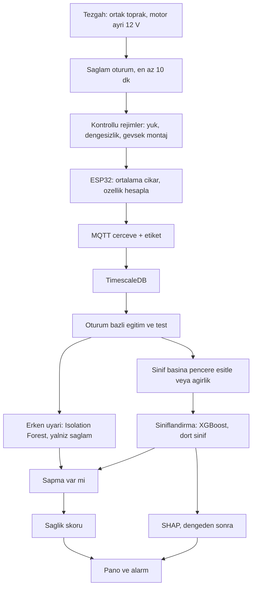

# Metodoloji

Bu not, SENTRA’nın nasıl izleneceğini ve hangi yayınların bu seçimi taşıdığını kaydeder. Çalıştırma adımları `../README.md` içindedir.

## İzleme sorusu

Her saniye tek bir soru sorulur: bu pencere, aynı motorun kendi sağlam kaydına göre sapmış mı, sapmışsa yük mü, dengesizlik mi, geniş bantlı titreşim mi?

ISO 20816-1:2016 endüstriyel makine sınıfları için RMS hız bölgeleri tanımlar. On iki voltluk laboratuvar motoru bu sınıflara girmez. Bölge rakamları kopyalanmaz. Sağlam oturumun ortancası ve yayılımı eşiktir.

## Hall A3144 ne işe yarar

Devir ayrı bir kanaldır. Titreşim RMS'i mutlak g olarak kalır.

Hall A3144, GPIO27’de darbe sayar. `rpm_from_pulses` bu darbeyi devir başına mıknatıs sayısına ve pencere süresine böler, 60 ile çarpar. Sonuç telemetrideki `rpm` alanıdır. Milde tek mıknatıs varsa devir başına bir darbe yazılır.

Titreşim özellikleri (`accel_rms_g`, tepe, crest factor, kurtosis, `dominant_freq_hz`) yalnız ivme penceresinden gelir. Önce ortalama çıkarılır, sonra RMS hesaplanır. RMS, `rpm` ile çarpılmaz ve `rpm`’ye bölünmez. Yerçekimi ofseti çıktıktan sonra RMS mutlak g cinsindendir.

`rpm` şu soruya cevap verir: baskın frekans, bu hızdaki 1× hat mı? Beklenen hat `rpm / 60` hertzdir. Dengesiz kütlede enerji bu hatta toplanır, kurtosis sinüse yakın kalır. Gevşek montajda RMS ve kurtosis birlikte büyür, enerji tek hatta oturmaz. Devir değişince sabit bir hertz eşiği yanlış hat çizer; FIT 2024’ün değişken hız uyarısı budur. Model, `rpm` ile `dominant_freq_hz` alanlarını yan yana görür. DSP fonksiyonunun imzasında devir yoktur (`docs/dsp.md`).

## İki model, iki soru

Isolation Forest ve XGBoost panoda iki ayrı satırdır. Birlikte durmalarının gerekçesi şudur.

**Isolation Forest erken uyarıdır.** Yalnız bu motorun sağlam oturumuyla eğitilir. Soru: bu pencere, sağlam bulutun dışında mı? Arıza etiketi istemez. Eğitimde hiç gösterilmemiş bir sapmayı da şüpheli sayabilir. Sınıf adı vermez.

**XGBoost sınıflandırmadır.** Dört etiketli rejimle eğitilir: `NORMAL`, `OVERLOAD`, `UNBALANCED`, `HIGH_VIBRATION`. Soru: bu pencere, gösterilen dört rejimden hangisine benziyor? Gösterilmemiş bir beşinci arızaya isim koyamaz; en yakın eğitilmiş sınıfa düşer.

Pano sırası:

1. Isolation Forest önce bakar.
2. Sapma yoksa sınıf adı aranmaz. Durum, bu motorun sağlam kaydına yakındır.
3. Sapma varsa ve XGBoost eğitilmişse, XGBoost dört isimden birini söyler.
4. Isolation Forest sapma der, XGBoost `NORMAL` derse sonuç “bilinmeyen sapma”dır. Sağlam diye kapatılmaz ve dört isimden birine zorlanmaz.

Sağlık skoru (V5) bu ayrımı tek yüzdeye ezmez. Erken uyarı ile sınıf adı panoda ayrı durur.

## Sınıf dengesi, SHAP’tan önce

Sağlam oturum en uzun kayıttır (en az on dakika). Aşırı yük ve gevşek montaj, ısınma ve mekanik risk yüzünden kısa tutulur. Pencere sayısı sağlamda şişerse XGBoost kararı sağlam sınıfa kayar. Genel doğruluk yüksek, arıza recall’u düşük kalır. SHAP bu kaymayı gerekçe gibi gösterir. Bu yüzden SHAP, denge kurulmadan hesaplanmaz.

Eğitimden hemen önce sınıf başına pencere sayısı yazılır. Hedef, dört sınıfta kullanılabilir pencere sayısını eşitlemektir.

- Uzun `NORMAL` oturumundan alt örnek alınır. Alt örnek, oturum boyunca eşit aralıklıdır. Aynı saniyenin kopyası çoğaltılmaz.
- Arıza oturumu termal güvenlik için kısa kalmak zorundaysa ve alt örnekleme sağlam sınıfı istatistik tutmayacak kadar küçültüyorsa, XGBoost örnek ağırlığı kullanılır. Ağırlık, en kalabalık sınıfın pencere sayısının o sınıfın pencere sayısına bölümüdür. Dört sınıf varken tek bir ikili `scale_pos_weight` yetmez; ağırlık sınıf başınadır.
- Yayınlanan rapor sınıf başına recall ve karışıklık matrisidir. Tek doğruluk yüzdesi yeterlilik sayılmaz.
- SHAP bu adımdan sonra, yüksek çıkan sınıf için hangi alanın ittiğini gösterir.

## Kalan ömür bu sürümün dışındadır

Sistem “şu an hangi durumdayız” der. “Ne zaman müdahale gerekir” demez. V1’den V8’e kadar olan iş durum tanıma, sağlık skoru, açıklama ve alarmdır. Kalan ömür (RUL) hesaplanmaz. Bir sağlık indeksinin eşiğe kaç saat kaldığı, bozulma eğrisi ve müdahale penceresi gelecek çalışmadır. Bu sınır, V1’in eksik bırakılması değildir. Başvuruda gelecek çalışma diye yazılır.

## Yayınlardan alınan karar

Ayrıntılı tablo README’dedir. Kısa sonuç:

1. Mekanik arıza titreşimde, akım sinyalinden daha temiz görünür. Akım yük ve elektriksel arıza için tutulur, titreşimin yerine geçmez.
2. Zaman düzlemi özellikleri (RMS, tepe, crest factor, kurtosis) ve baskın frekans, rulman ve dengesizlik literatürünün ortak dilidir. Devir bu özellikleri ölçeklemez; 1× hattını okumak için ayrı kanaldır.
3. Etiket yokken Isolation Forest erken uyarıdır. Etiket varken tablo özelliği üzerinde XGBoost dört sınıf söyler. Ham dalga üzerinde CNN bazı tezgahlarda daha yüksek doğruluk vermiştir. SENTRA ham pencereyi sürekli taşımaz, bu yüzden ilk model özellik üzerindedir.
4. Doğruluk, pencereyi rastgele bölerek değil, oturumu bölerek ölçülür. Aynı kayıttan kesilen komşu pencereler hem eğitime hem teste girerse rakam şişer.
5. Sınıf başına pencere sayısı eşitlenmeden veya ağırlık yazılmadan XGBoost sonucu ve SHAP açıklaması raporlanmaz.
6. SHAP, hangi özelliğin kararı taşıdığını göstermek içindir. Özellik listesini baştan şişirmek için değildir.

## İş akışı

Kalan ömür bu akışta yoktur. Gelecek çalışma kutusuna yazılır, V1–V8 adımının yerine geçmez.

## Veri toplama kuralı

- Sensör motor gövdesine her oturumda aynı yön ve aynı noktadan bağlanır.
- Her oturum bir klasör veya bir `condition` etiketidir. Pencere etiketi oturumdan gelir.
- Sağlam kayıt, arıza kayıtlarından ayrı günde de tekrarlanır. Tek bir sağlam dakikası modelin tamamı olmaz.
- Motor kilitliyken uzun süre akım basılmaz. Aşırı yük oturumu kısa tutulur ve sıcaklık izlenir.
- Test klasöründeki oturum, eğitim klasörüne hiç girmez.
- XGBoost eğitim tablosu kurulurken sınıf başına pencere sayısı yazılır. Sayılar birbirinden belirgin büyükse, SHAP’tan önce alt örnekleme veya sınıf ağırlığı uygulanır.
