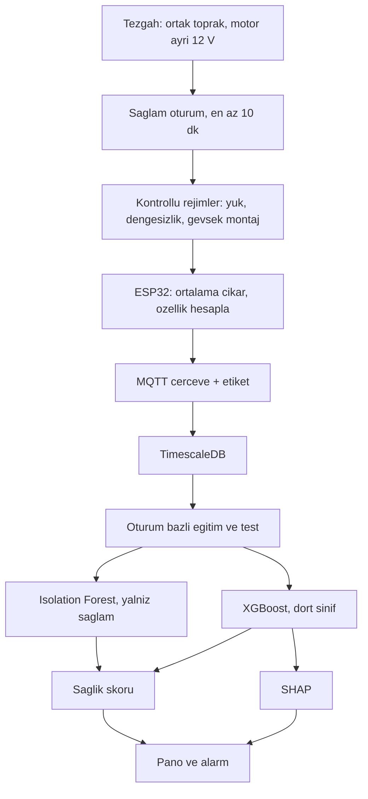

# Metodoloji

Bu not, SENTRA’nın nasıl izleneceğini ve hangi yayınların bu seçimi taşıdığını kaydeder. Çalıştırma adımları `../README.md` içindedir.

## İzleme sorusu

Her saniye tek bir soru sorulur: bu pencere, aynı motorun kendi sağlam kaydına göre sapmış mı, sapmışsa yük mü, dengesizlik mi, geniş bantlı titreşim mi?

ISO 20816-1:2016 endüstriyel makine sınıfları için RMS hız bölgeleri tanımlar. On iki voltluk laboratuvar motoru bu sınıflara girmez. Bölge rakamları kopyalanmaz. Sağlam oturumun ortancası ve yayılımı eşiktir.

## Yayınlardan alınan karar

Ayrıntılı tablo README’dedir. Kısa sonuç:

1. Mekanik arıza titreşimde, akım sinyalinden daha temiz görünür. Akım yük ve elektriksel arıza için tutulur, titreşimin yerine geçmez.
2. Zaman düzlemi özellikleri (RMS, tepe, crest factor, kurtosis) ve baskın frekans, rulman ve dengesizlik literatürünün ortak dilidir.
3. Etiket yokken Isolation Forest; etiket varken tablo özelliği üzerinde XGBoost. Ham dalga üzerinde CNN bazı tezgahlarda daha yüksek doğruluk vermiştir. SENTRA ham pencereyi sürekli taşımaz, bu yüzden ilk model özellik üzerindedir.
4. Doğruluk, pencereyi rastgele bölerek değil, oturumu bölerek ölçülür. Aynı kayıttan kesilen komşu pencereler hem eğitime hem teste girerse rakam şişer.
5. SHAP, hangi özelliğin kararı taşıdığını göstermek içindir. Özellik listesini baştan şişirmek için değildir.

## İş akışı

## Veri toplama kuralı

- Sensör motor gövdesine her oturumda aynı yön ve aynı noktadan bağlanır.
- Her oturum bir klasör veya bir `condition` etiketidir. Pencere etiketi oturumdan gelir.
- Sağlam kayıt, arıza kayıtlarından ayrı günde de tekrarlanır. Tek bir sağlam dakikası modelin tamamı olmaz.
- Motor kilitliyken uzun süre akım basılmaz. Aşırı yük oturumu kısa tutulur ve sıcaklık izlenir.
- Test klasöründeki oturum, eğitim klasörüne hiç girmez.
